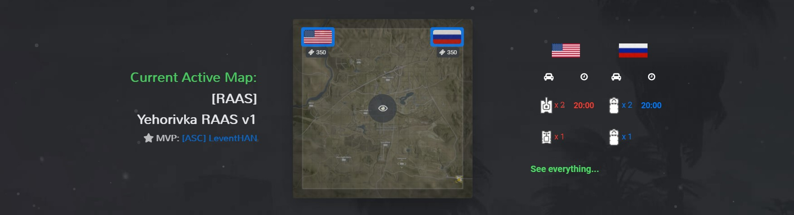

    <strong><a href="https://github.com/mahtoid/SquadMaps/issues/34">The Future of SquadMaps</a></strong>

 

[![Forks][forks-shield]][forks-url]
[![Stargazers][stars-shield]][stars-url]
[![Issues][issues-shield]][issues-url]
[![GPL License][license-shield]][license-url]

  <h2>SquadMaps</h2>

  

    View map and layer information for Squad!
     
    <a href="https://discord.gg/2uhHBQDwcc">Join Discord</a>
    ·
    <a href="https://github.com/mahtoid/SquadMaps/issues/new?assignees=&labels=bug&template=bug-report.yml">Report Bug</a>
    ·
    <a href="https://github.com/mahtoid/SquadMaps/issues/new?assignees=&labels=enhancement&template=feature-request.yml">Request Feature</a>
  

---
## About
SquadMaps is a website to display all the maps and layers in Squad. 

Along with every map/layer, each contains:
 - Team Information (Name and Total Tickets)
 - Vehicle Information (Name, Quantity and Delays)
 - Layer Information (Weather, Command and Total Capture Points)
 - and more!

---
## Usage
To use SquadMaps, head to https://squadmaps.com and begin! 

The navigation of the site will take you to the map section where you can see an overview of all the different layers. Clicking on the 'Vehicle Icon' you will be able to get more detail of the layer.

---
## Screenshots

<b>Homepage</b>

<b>Layer Details</b>

    

---
## Additional Functions
You can use the object inside the modal.js, for example to make your own visual map statistics like:

---
## Attributions

- *This project borrows captured Map Data from [Squad Wiki Editorial](https://github.com/Squad-Wiki-Editorial/squad-wiki-pipeline-map-data) repository.*
- *This project borrows icons, map backgrounds and game information from game files shipped through Steam for [Squad](https://joinsquad.com).*

<!-- LINK DUMP -->
[language-dom]: https://img.shields.io/github/languages/top/mahtoid/SquadMaps?style=for-the-badge
[forks-shield]: https://img.shields.io/github/forks/mahtoid/SquadMaps?style=for-the-badge
[forks-url]: https://github.com/mahtoid/SquadMaps/
[stars-shield]: https://img.shields.io/github/stars/mahtoid/SquadMaps?style=for-the-badge
[stars-url]: https://github.com/mahtoid/SquadMaps/stargazers
[issues-shield]: https://img.shields.io/github/issues/mahtoid/SquadMaps?style=for-the-badge
[issues-url]: https://github.com/mahtoid/SquadMaps/issues
[license-shield]: https://img.shields.io/github/license/mahtoid/SquadMaps?style=for-the-badge
[license-url]: https://github.com/mahtoid/SquadMaps/blob/master/LICENSE
[github-url]: https://github.com/mahtoid/SquadMaps/
