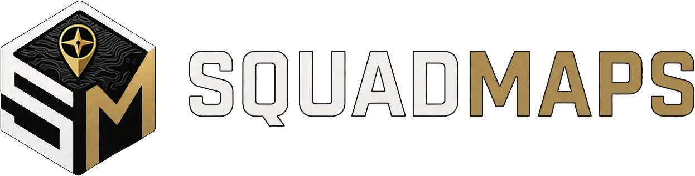
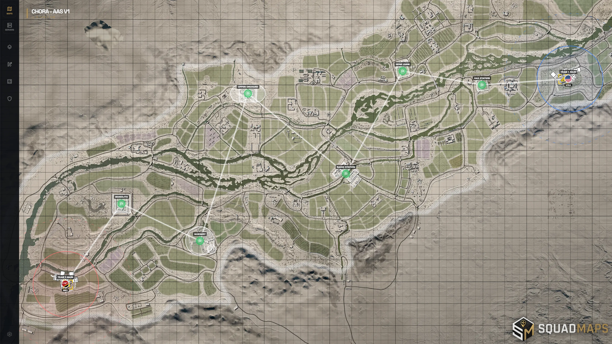
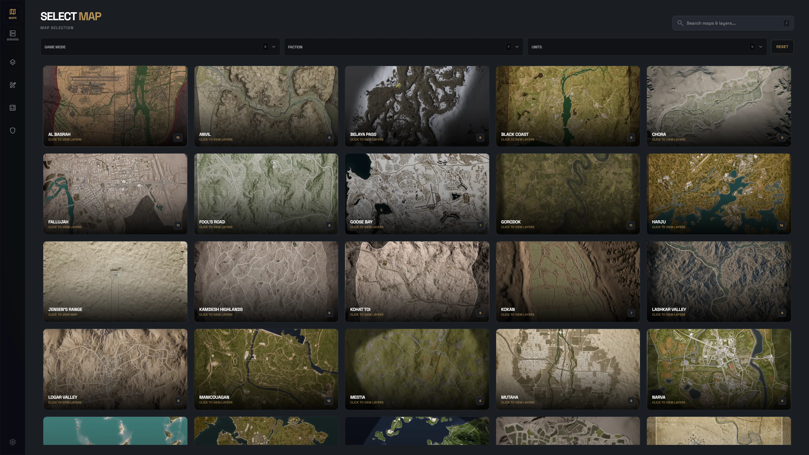
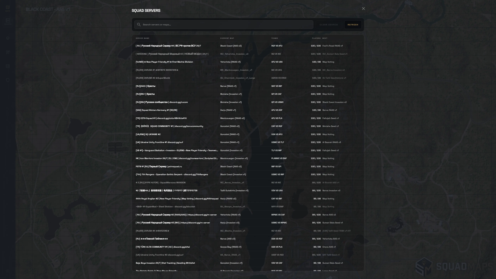
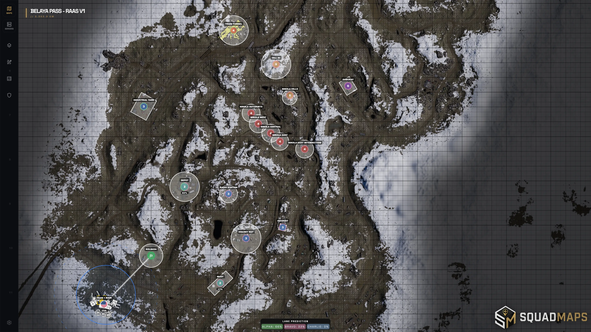
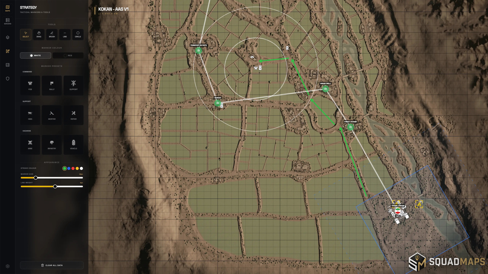
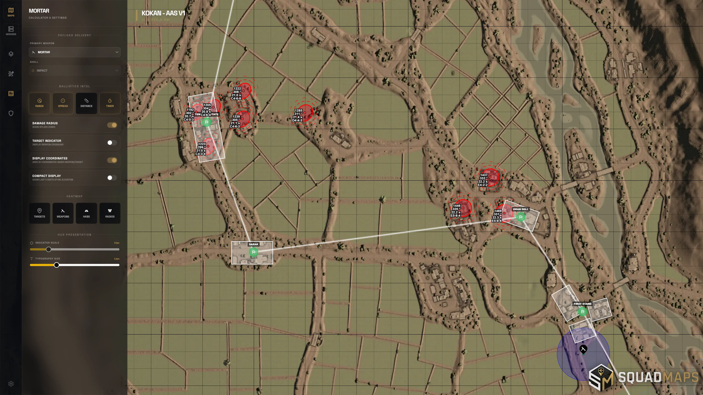
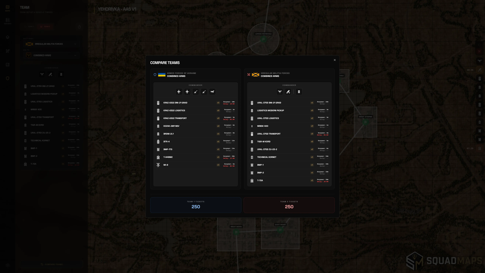

 
 

A complete dictionary of Squad Maps and layers available in-game, with enhanced tooling to become your tactical companion.

 

 

---

## What is SquadMaps?

**SquadMaps** is a web companion for [*Squad*](https://joinsquad.com) by Offworld Industries. Browse every map and layer, inspect factions, vehicles, tickets, and capture points - then enhance your match with tools built specifically for Squad players.

---

## Features

<table>
<tr>

<td width="33%" valign="top">
<h3>🗺️ Maps & Layers</h3>
Browse every layer with team setup, tickets, weather, commander rules, and vehicle spawns.  

</td>

<td width="33%" valign="top">
<h3>📡 Live Servers</h3>
Browse Squad servers and jump directly to the layer. Automatically follows map changes.  

</td>

<td width="33%" valign="top">
<h3>🎯 Overlays & RAAS</h3>
Lane prediction, probability indicators, capture zones, grid overlays, and multiple map views.  

</td>

</tr>

<tr>

<td width="33%" valign="top">
<h3>🧭 Interactive Map</h3>
Draw markers, paths, circles, and text. Share via URL or <code>.squadmaps</code> files.  

</td>

<td width="33%" valign="top">
<h3>🎯 Mortar Calculator</h3>
Target calc incl. spread and damage overlays, grid coordinate support and more.  

</td>

<td width="33%" valign="top">
<h3>🪖 Team Intel</h3>
Vehicles, commander assets, destroyed asset tracking, and team comparison.  

</td>

</tr>
</table>

 

---

## Translations

SquadMaps is used by players worldwide. Translations are community-maintained - we need native speakers who know Squad terminology, not machine translations.

| Supported Languages | Locale | Notes |
|----------|--------|----------|
| 🇬🇧 English | `en` | Reference file |
| 🇩🇪 Deutsch | `de` | in active progress |
| 🇫🇷 Français | `fr` | in active progress |
| 🇷🇺 Русский | `ru` | in active progress |
| 🇨🇳 中文 | `zh-CN` | ✅ |
| 🇺🇦 Українська | `ua` | ✅ |

Progress is measured against `locale/en.json`. Read [CONTRIBUTING.md](CONTRIBUTING.md#translations), edit the locale file for your language, and open a pull request.

---

## About this Repository

This public repository is SquadMaps' community hub - translation files, issue tracking, and release notes. The live web app source is maintained separately and is not open-source today, though that may change. For now, **translations are the most impactful contribution you can make.**

---

## Support the Project

SquadMaps is free to use. If it saves you time in-game, consider supporting hosting and development on Ko-fi. Donations are entirely optional and do not unlock any features.

---

## Attributions

- **[Napster365](https://steamcommunity.com/id/napster653/)** - originally began this project
- **[Squad Wiki Editorial](https://github.com/Squad-Wiki-Editorial/squad-wiki-pipeline-map-data)** - map data pipeline
- **[Offworld Industries](https://joinsquad.com/)** - icons, minimaps, and game assets from *Squad*

---

## Licence

Licensed under the [GNU Affero General Public License v3.0](LICENSE).

 

Made with ❤️ for the Squad community

